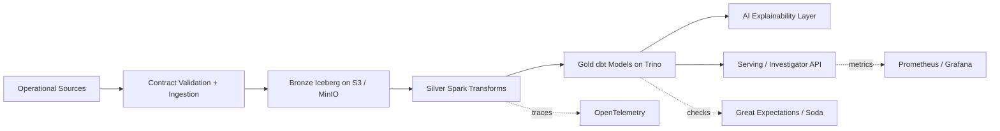
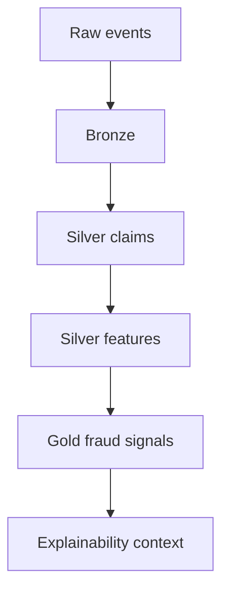
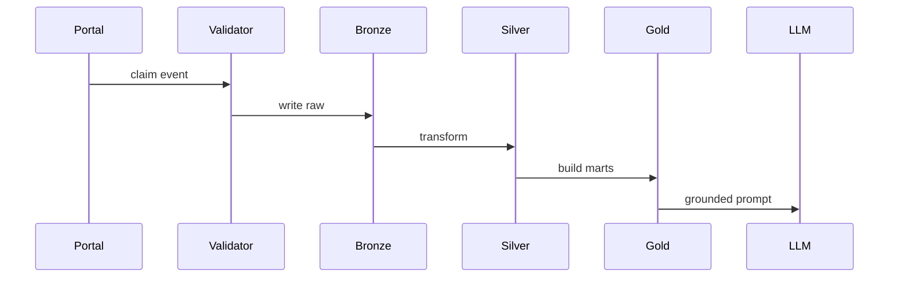

# Incentive Fraud Lakehouse

Open-source-first, AWS-native reference architecture for real-time incentive and rebate fraud detection with explainable AI.

This repository demonstrates a production-style data platform for ingesting claim events, validating data contracts, persisting raw and curated data in Apache Iceberg on S3-compatible storage, transforming fraud features with Spark and dbt, serving analytics through Trino, and generating grounded investigator explanations with a swappable LLM provider interface.

## Problem

In rebate and incentive programs, fraud emerges as patterns across partners, claimants, SKUs, banking details, timing windows, and policy misuse. This project models the full platform:

- streaming and batch-style ingestion
- medallion lakehouse on Iceberg
- contract enforcement and quarantine
- quality gates
- lineage and metadata integration points
- investigator-facing marts
- explainable AI grounded in policy documents and historical cases

## Architecture



## Medallion Flow



## Single Event Lifecycle



## Managed-to-open swap table

| Managed / AWS-native component | Purpose | OSS / self-hosted equivalent |
|---|---|---|
| S3 | Object storage for Iceberg tables | MinIO |
| Kinesis / MSK | Event ingestion | Kafka / Redpanda |
| EMR Serverless | Spark compute | Local Spark / Spark on Kubernetes |
| MWAA | Airflow orchestration | Self-hosted Airflow |
| Bedrock | LLM inference | Ollama / vLLM / TGI |
| OpenSearch Vector | Vector retrieval | Chroma / pgvector / Qdrant |
| CloudWatch | Log sink / monitoring | Prometheus + Grafana + Loki |

## Local development path

```bash
cp .env.example .env
make bootstrap
make up
make seed
make demo
```

## Key commands

```bash
make lint
make test
make up
make down
make seed
make demo
make dbt-run
make quality
make explain CLAIM_ID=clm-33
```
